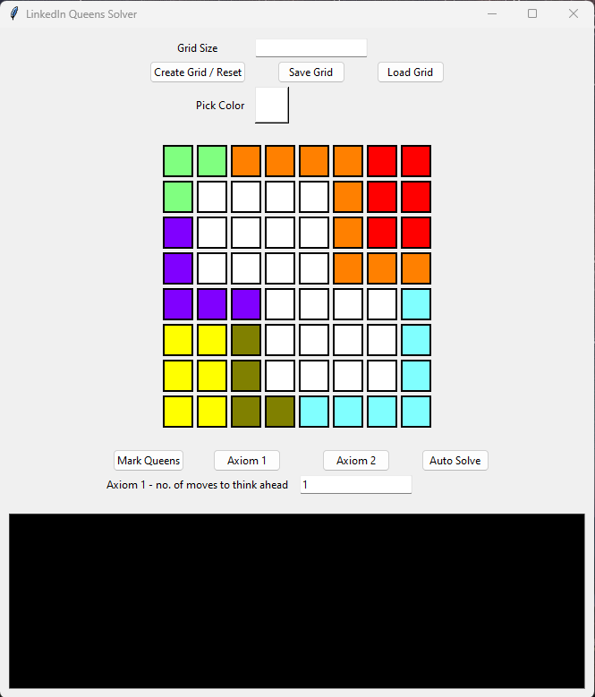
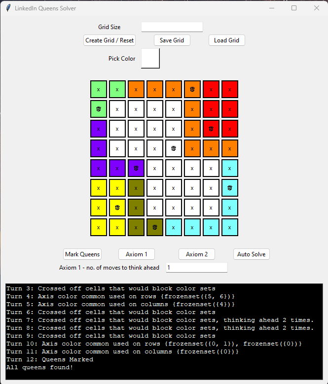

# About
This project is a puzzle solver, with a simple tkinter Graphical User Interface, for the LinkedIn flavor of the 'Queens' puzzle.

You can learn about the puzzle and its rules at https://www.linkedin.com/help/linkedin/answer/a6269510.

## Board Examples
A starting board:



A solved board:



# Usage
## Prerequisites
Python must be installed on your system.
The program was developed and tested on Python 3.11, but any reasonably modern Python version should work. 

Modern versions of Python come with `tkinter`, which is what this program uses to create the GUI. If not it has to be installed manually.

## Quickstart - Launch on Windows
Double click the `launch (windows).bat` file.

## Launch on Any Platform
```bash
python3 run_gui.py
```

## Load Example Puzzles
Use the `Load Grid` button to load pre-saved puzzles found in the `examples` folder (json files).


# How Does it Work?
In addition to the rules of Queen placement:
- Each row must have one and only one queen
- Each column must have one and only one queen
- Each colorset must have one and only one queen
- Every queen must be separated from each other by at least one square (including diagonals)

2 axioms are used to narrow down the puzzle board by finding and crossing out cells that cannot be queens.
1. A cell that, if were a queen, would completely block all cells of a colorset from having a queen, cannot be a queen.
    - This rule can be extended - the cell may not immediately block all cells of a colorset, but the remaining cells would have no combination of queens that would lead to all colorsets not been blocked. (Can 'think ahead' multiple moves as required)
2. If n columns/rows contain the entirety of n colorsets, the cells of all other colors within those n columns/rows can be crossed (i.e. marked as unable to be queens)

This logic is applied in a loop in `main.py`.

# Limitations and Future Improvements
- Assumes the puzzle is solvable.
- Assumes the puzzle only has one solution.
- If the above 2 conditions are not met, the program may place queens or crosses at invalid positions.
- GUI currently does not support the creation of starting boards with pre-placed queens.
- The program has not been tested on puzzles that require the thinking of 3 or more moves ahead.
- Logic loop (for the autosolver):
    - Right now main.py simply executes the Queen marking rules and the 2 axioms in a loop. But maybe it's possible for the program to choose which rule or axiom to execute.
- User input edge case testing, general QA testing...
- The `launch (windows).bat` file causes a terminal to be open in the background.
    - Trying to bypass this (using pythonw.exe for example) is problematic due to the use of stdout and stderr by the GUI terminal.

# Technical Notes
## X-Y-Origin Convention
X-coord is from left to right. Y-coord is from top to bottom. Origin is at the top-left of the board. 0-indexing is used.


## Examples
The `examples` directory contains 2 solved examples.


## Tests
`test.py` tests the auto_solver function of the SolvingLogic class.