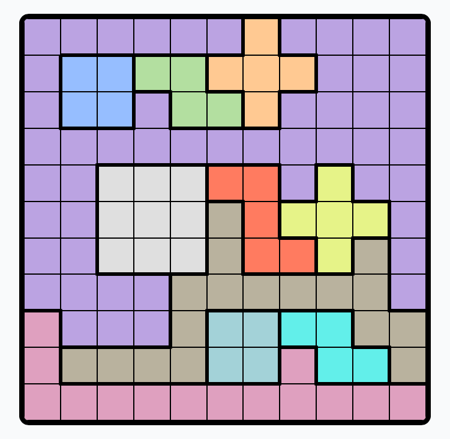
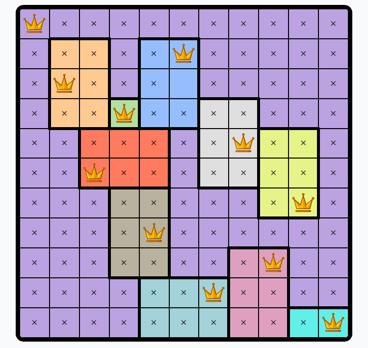
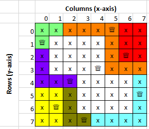
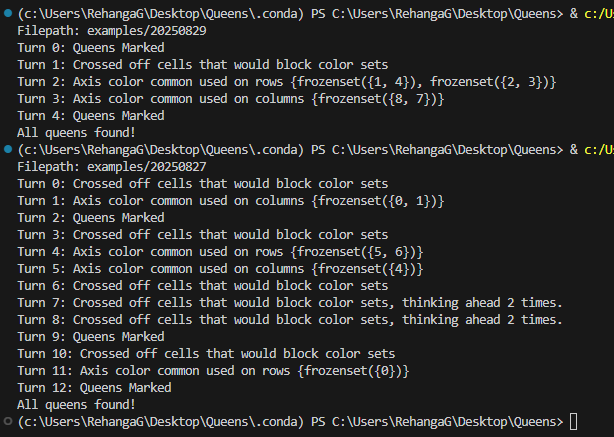

# About
This project is a puzzle solver for the LinkedIn flavor of the 'Queens' puzzle.

You can learn about the puzzle and its rules at https://www.linkedin.com/help/linkedin/answer/a6269510.

## Board Examples
A starting board:

A solved board:

# How 2 Use
## Prerequisites
Install the python packages from `requirements.txt`. It just contains `openpyxl` for printing out the board with its solution and steps.

## Usage
- Run `puzzle_grid_gui.py' to create starting puzzle grids.
    - It provides an as-of-now vibe-coded tkinter GUI.
    - You can create starting puzzles via the GUI and save them as .json files.
    - You can also load .json files to visualize them.
- Set the `FILEPATH` variable without the '.json' extension in `main.py` and run it.
    - The solving steps will be printed on the terminal.
    - The board solution with its solution steps will be printed out in an excel file with the same filepath and filename as the .json file.

# How Does it Work?
In addition to the rules of Queen placement:
- Each row must have one and only one queen
- Each column must have one and only one queen
- Each colorset must have one and only one queen
- Every queen must be separated from each other by at least one square (including diagonals)

2 axioms are used to narrow down the puzzle board by finding and crossing out cells that cannot be queens.
1. A cell that, if were a queen, would completely block all cells of a colorset from having a queen, cannot be a queen.
    - This rule can be extended - the cell may not immediately block all cells of a colorset, but the remaining cells would have no combination of queens that would lead to all colorsets not been blocked. (Can 'think ahead' multiple moves as required)
2. If n columns/rows contain the entirety of n colorsets, the cells of all other colors within those n columns/rows can be crossed (i.e. marked as unable to be queens)

This logic is applied in a loop in `main.py`.

# Limitations
- Assumes the puzzle is solvable.
- Assumes the puzzle only has one solution.
- If the above 2 conditions are not met, the program may place queens or crosses at invalid positions.
- GUI currently does not support the creation of starting boards with pre-placed queens.
- The program has not been tested on puzzles that require the thinking of 3 or more moves ahead.

# Technical Notes
## X-Y-Origin Convention
X-coord is from left to right. Y-coord is from top to bottom. Origin is at the top-left of the board. 0-indexing is used.

## Examples
The `examples` directory contains 2 solved examples.

